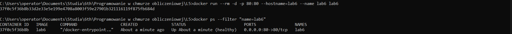
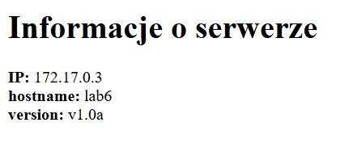

# PAWChO Lab6

## Budowa obrazu i uruchomienie kontenera:

### Budowa obrazu:
```
set DOCKER_BUILDKIT=1&& docker build --ssh default -t lab6 .
```

### Uruchomienie kontenera:
```
docker run --rm -d -p 80:80 --hostname=lab6 --name lab6 lab6
```

## Sprawdzenie działania kontenera:

### Status w konsoli:
```
docker ps
```



### Działanie w przeglądarce (http://localhost):



