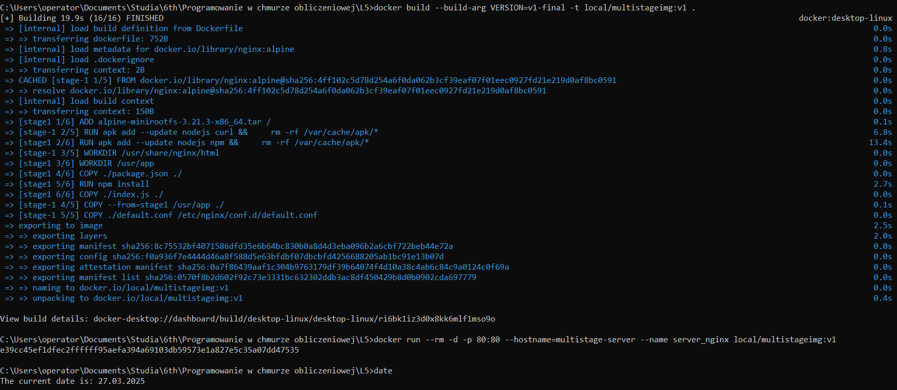
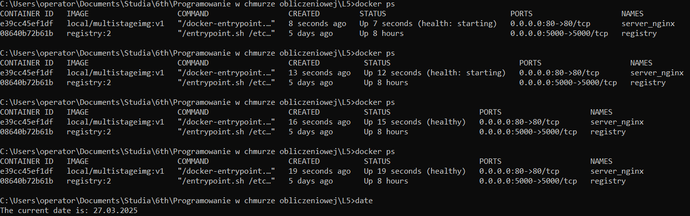
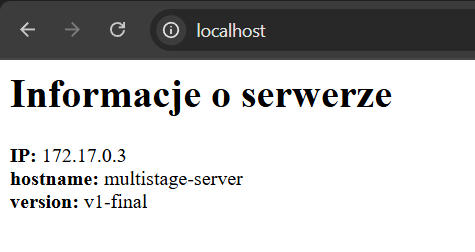
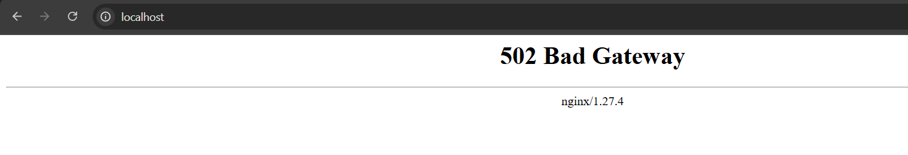
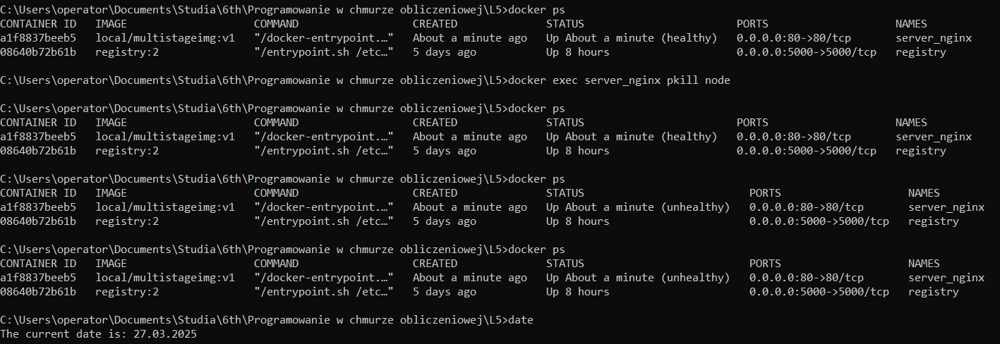

# PAWChO Lab5 - sprawozdanie

## Utworzony Dockerfile:

```
#====================STAGE 1====================
FROM scratch AS stage1
ADD alpine-minirootfs-3.21.3-x86_64.tar /

RUN apk add --update nodejs npm && \
    rm -rf /var/cache/apk/*

WORKDIR /usr/app

COPY ./package.json ./

RUN npm install

COPY ./index.js ./

#====================STAGE 2====================
FROM nginx:alpine

RUN apk add --update nodejs curl && \
    rm -rf /var/cache/apk/*

WORKDIR /usr/share/nginx/html

COPY --from=stage1 /usr/app ./

COPY ./default.conf /etc/nginx/conf.d/default.conf

HEALTHCHECK --interval=15s --timeout=3s \
  CMD curl -f http://localhost/ || exit 1

ARG VERSION
ENV APP_VERSION=${VERSION:-v1.0a}

EXPOSE 80

CMD ["sh", "-c", "node ./index.js & nginx -g 'daemon off;'"]
```

## Budowa obrazu i uruchomienie kontenera:

### Budowa obrazu:
```
docker build --build-arg VERSION=v1-final -t local/multistageimg:v1 .
```

### Uruchomienie kontenera:
```
docker run --rm -d -p 80:80 --hostname=multistage-server --name server_nginx local/multistageimg:v1
```



## Sprawdzenie działania kontenera:

### Status w konsoli:
```
docker ps
```



### Działanie w przeglądarce (http://localhost):



## Test działania sprawdzania poprawności działania:

### Zabicie procesu node'a w kontenerze:
```
pkill node
```

### Zawartość strony:



### Status kontenera:



